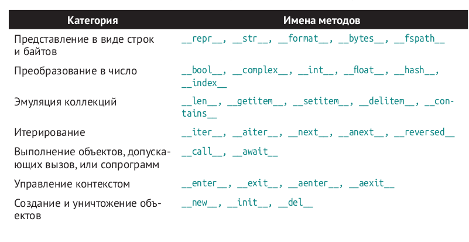
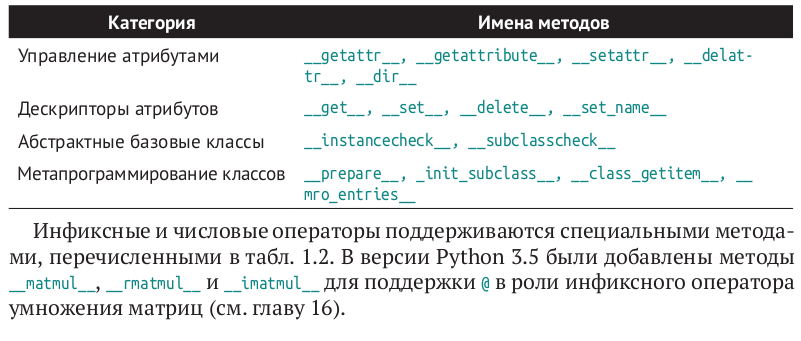
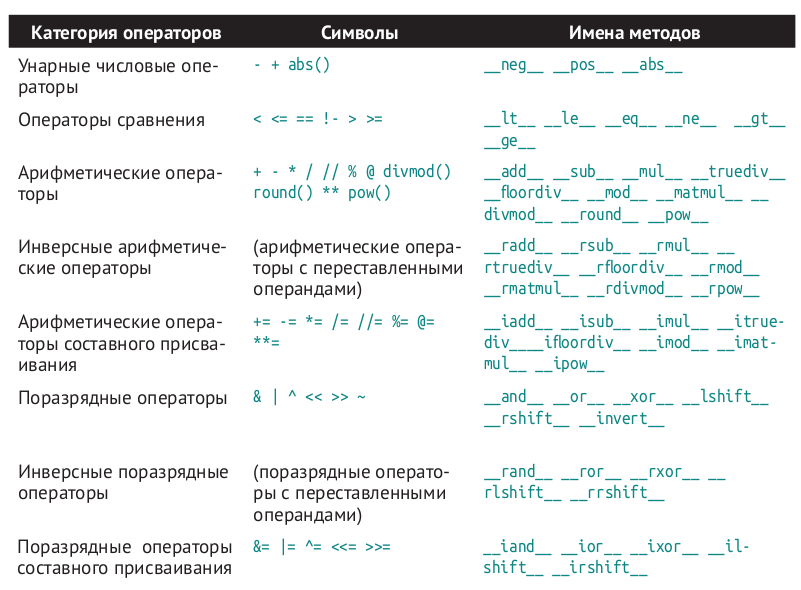

# Python 

## Построения классов, содержащих только атрибуты и никаких методов

```python
import collections
Card = collections.namedtuple('Card', ['rank', 'suit'])
```

## Строковое представление

#### Мы используем !r для получения стандартного представления отображаемых атрибутов. Это разумный подход, потому что в нем отчетливо проявляется существенное различие между Vector(1, 2) и Vector('1', '2')


```python
def __repr__(self):
return f'Vector({self.x!r}, {self.y!r})'
```

## Булево значение пользовательского типа

#### По умолчанию любой экземпляр пользовательского класса считается истинным, но положение меняется, если реализован хотя бы один из методов __bool__ или __len__. Функция bool(x), по существу, вызывает x.__bool__() и использует полученный результат. Если метод __bool__ не реализован, то Python пытается вызвать x.__len__() и при получении нуля функция bool возвращает False. В противном случае bool возвращает True.

## Dunder methods(магические метод)





## Встроенные контейнеры 

### Контейнерные последовательности
Позволяют хранить элементы разных типов, в т. ч. вложенные контейнеры.
Примерами могут служить list, tuple и collections.deque.

### Плоские последовательности
Позволяют хранить элементы только одного типа. Примерами могут слу-
жить str, bytes и array.array.