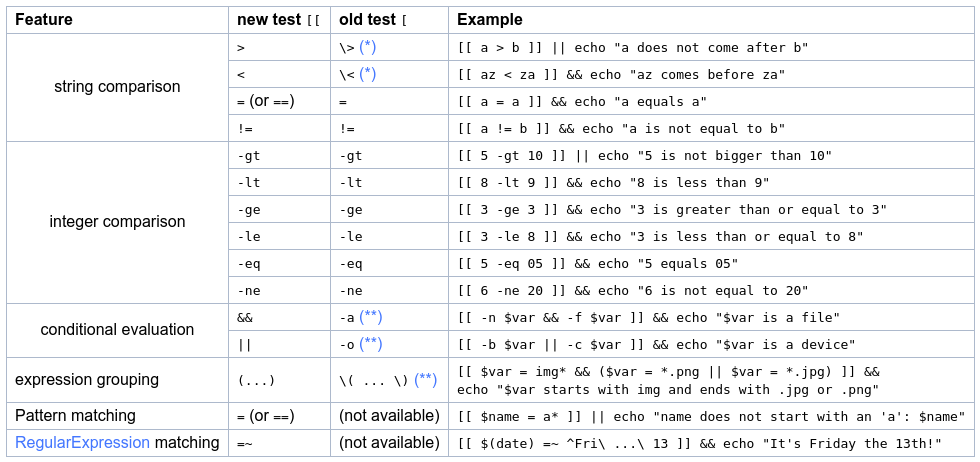

# Shell scripting

## Переменные

```sh
foo=bar
echo "$foo"
# prints bar
echo '$foo'
# prints $foo
```

## Функции


```sh
mcd () {
  mkdir -p "$1"
  cd "$1"
}
```

Эта функция берёт первый аргумент, создаёт папку и входит в нее. `$1` &mdash;
обозначение аргумента в функциях. В функциях можно использовать следующие
обозначения:

* `$0` &mdash; имя функции
* `$1` до `$9` &mdash; аргументы функции. Для 10 или более аргументов используйте `{}` скобки, например, `${10}`. Максимальное количество аргументов &mdash; 255
* `$@` &mdash; все аргументы
* `$#` &mdash; количество аргументов
* `$?` &mdash; код возврата предыдущей команды
* `$$` &mdash; PID данного процесса
* `!!` &mdash; полное повторение Вашей предыдущей команды, удобно, например, когда Вам нужно sudo, можно просто написать `sudo !!`


## Условия

```sh
false || echo "Fail"
# Fail
true || echo "Will not be printed"
#
true && echo "Things went well"
# Things went well
false && echo "Will not be printed"
#
true ; echo "This will run anyway"
# This will run anyway
false ; echo "This will run anyway"
# This will run anyway
```

`||` &mdash; условие справа выполняется только если левое вернуло ненулевой код
возврата или то же самое, что и оператор "или", `&&` &mdash; то же самое, что и
оператор "и". `;` &mdash; просто разделитель.

В bash очень часто используется подстановка команд через `$`. Вы можете
в любом месте вставить `$(cmd)` и оно подставит результат `cmd` уже как данные
переменной. Самый частый способ так делать это, например,  `for i in $(ls)`
&mdash; итерация по всем сущностям текущей папки.


## Shebang(#!)

Любой bash скрипт должен начинаться с так называемого [shebang](https://en.wikipedia.org/wiki/Shebang_(Unix)),
который указывает на то, с помощью какого интерпретатора нужно исполнять скрипт.

```sh
#!/bin/bash
```

Или для Python:

```sh
#!/usr/local/bin/python
```

После этого начинается скрипт. В bash Вы можете писать любые команды с новой
строки, они выполняются построчно, функции, переменные, вызовы функций и т.д.

## Цикл for

Один из стандартных циклов в общем случае выглядит так:

```sh
for item in [LIST]
do
  [COMMANDS]
done
```

`LIST` это любой лист объектов, разделенный пробельным символом
(как минимум \n, \t, ' '), например:

```sh
for element in Hydrogen Helium Lithium Beryllium
do
  echo "Element: $element"
done
```

Также можно итерироваться по числам:

```sh
for i in {1..15}
do
  echo "Number: $i"
done
```

Можно ещё с определённым шагом:

```sh
for i in {1..15..3}
do
  echo "Number: $i"
done
```

И в обратном направлении:

```sh
for i in {15..1..-3}
do
  echo "Number: $i"
done
# Number: 13
# Number: 10
# Number: 7
# Number: 4
# Number: 1
```

Можно итерироваться по листам, например, аргументов (c 1-го):

```sh
for file in "$@"
do
  echo $file
done
```

Можно писать обычные циклы, к которым мы привыкли в C/C++:

```sh
for ((i = 0 ; i <= 20 ; i += 5)); do
  echo "Counter: $i"
done
```

`((cmd))` всегда означает математическое вычисление. Вы можете вычислять
стандартные математические выражения c числами и операторами `+`, `-`, `/`, `*`, `%`, `^`. К
сожалению, если что-то окажется не числом, оно заменяется на ноль, а shell не
выдаёт и не вернёт ошибку:

```sh
$ a=5
$ echo $((a^5))
0
$ echo $((a*5))
25
$ a=rfr
$ echo $((a*5))
0
$ echo $((a*5))
0
```

В циклах можно писать `break`, `continue`.

## if, case statements

Общий синтаксис для `if` советует придерживаться двойным `[[]]` скобкам:

```sh
if [[ a op b ]]
then
  [COMMANDS]
else
  [OTHER_COMMANDS]
fi
```

В таблице представлены какие
операции можно делать:



Также можно перед любыми условиями писать `!` &mdash; отрицание, как мы привыкли
в C/C++.

Оператор `else` является необязательным.

`case` чуть-чуть сложнее, выглядит он так:

```sh
case [variable] in
  [pattern 1])
  [commands]
  ;;
  [pattern 2])
  [other commands]
  ;;
esac
```

Где patterns являются
регулярными выражениями, commands обычными командами, двойной `;` нужен
обязательно.

## Другие операции

У переменных можно брать подстроки примерно как в Python, например:

```console
$ echo ${PATH:0:2}
/u
$ echo ${PATH:0:-1}
/usr/local/sbin:/usr/local/bin:/usr/sbin:/usr/bin:/sbin:/bi
$ echo ${PATH:50:-1}
/sbin:/bi
```

Заменять подстроки:

```console
$ first="HSE is worse than MIPT"
$ second="better"
$ echo "${first/worse/$second}"
HSE is better than MIPT
```

И по регулярному выражению:

```console
$ message='The secret code is 12345'
$ echo "${message/[0-9]*/X}"
The secret code is X
```

И даже все вхождения, а не только первое c помощью дополнительного слеша:

```console
$ message='The secret code is 12345'
$ echo "${message//[0-9]/X}"
The secret code is XXXXX
```

## Раскрытие скобок

В bash очень удобно раскрывать множество значений одновременно, например:

```console
$ touch problem_{1..5}.cpp
$ ll | grep problem
-rw-r--r-- 1 danilak primarygroup   0 Aug 16 20:41 problem_1.cpp
-rw-r--r-- 1 danilak primarygroup   0 Aug 16 20:41 problem_2.cpp
-rw-r--r-- 1 danilak primarygroup   0 Aug 16 20:41 problem_3.cpp
-rw-r--r-- 1 danilak primarygroup   0 Aug 16 20:41 problem_4.cpp
-rw-r--r-- 1 danilak primarygroup   0 Aug 16 20:41 problem_5.cpp
```

Можно делать через запятую, они все раскрываются:

```console
$ touch problem_{1,2,3,4,5}_{1,2,3,4,5,7,10}.cc
$ ll | grep problem_ | wc -l
35
$ rm problem_*
```

Также в bash поддерживаются wildcard аннотации `*` &mdash; (взять всё) и `?` &mdash; один
символ. Полезно при удалении/поиске/архивировании огромного ряда файлов
по такому простому регулярному выражению.

